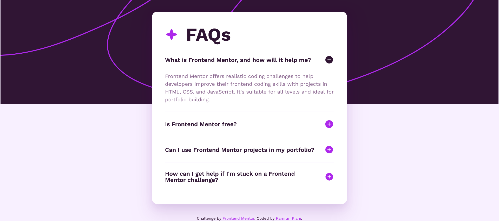

# Frontend Mentor - FAQ accordion solution

This is a solution to the [FAQ accordion challenge on Frontend Mentor](https://www.frontendmentor.io/challenges/faq-accordion-wyfFdeBwBz).

## Table of contents

- [Overview](#overview)
  - [The challenge](#the-challenge)
  - [Screenshot](#screenshot)
  - [Links](#links)
- [My process](#my-process)
  - [Built with](#built-with)
  - [What I learned](#what-i-learned)
  - [Continued development](#continued-development)
  - [Useful resources](#useful-resources)
- [Author](#author)
- [Acknowledgments](#acknowledgments)

## Overview

### The challenge

Users should be able to:

- Hide/Show the answer to a question when the question is clicked
- Navigate the questions and hide/show answers using keyboard navigation alone
- View the optimal layout for the interface depending on their device's screen size
- See hover and focus states for all interactive elements on the page

### Screenshot

### Links

- Solution URL: [Github](https://github.com/kaamiik/fm-FAQ-accordion-using-astro-sass)
- Live Site URL: [Vercel](https://fm-faq-accordion-using-astro-sass.vercel.app/)

## My process

### Built with

- Semantic HTML5 markup
- CSS custom properties
- Flexbox
- CSS Grid
- Mobile-first workflow
- Astro
- Sass
- Vanilla JS
- Accessibility

### Useful resources

- [Example resource 1](https://fedmentor.dev/posts/disclosure-ui/) - This helped me for building an accessible disclosure. I really liked this pattern and will use it going forward.

- [Example resource 2](https://adrianroselli.com/2023/08/progressively-enhanced-html-accordion.html) - This is an amazing article which helped me understand `details` and `summary` elements for building an accessible accordion. I'd recommend it to anyone still learning this concept.

## Author

- Frontend Mentor - [@kaamiik](https://www.frontendmentor.io/profile/kaamiik)
- Twitter - [@kiaakamran](https://www.twitter.com/kiaakamran)
